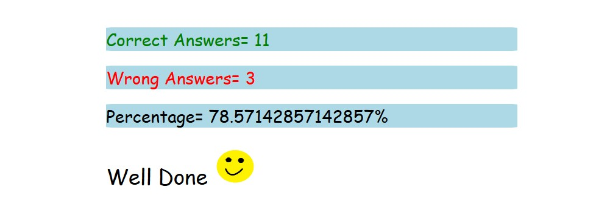

# Assignment 2

# 1. What are the variable naming conventions in JavaScript?
## Variables are case sensitive
## Variables can be single character , multiple character or alpha numeric
## camelCasing is the best pratices
## Only two symbols can be used in variables $ and _
## Variables cannot start with a no
## Cannot use keywords as variables
## Variables have cannot use space in between words

# 2. Create a greeting alert (use => prompt, message, alert)
``` JS
let user = prompt("Enter Your name: ")
alert(`hello ${user}`)

```

# 3.Write some code so that the values of the below variables switch around 
# Let a = 5, let b = 8. Switch the value so that a holds the value 8 and the variable b holds the value 5
``` JS
let a = 5
let b = 8
let c = b
b = a
a = c
console.log(`a = ${a}`)
console.log(`b = ${b}`)
```

# 4.Quiz
