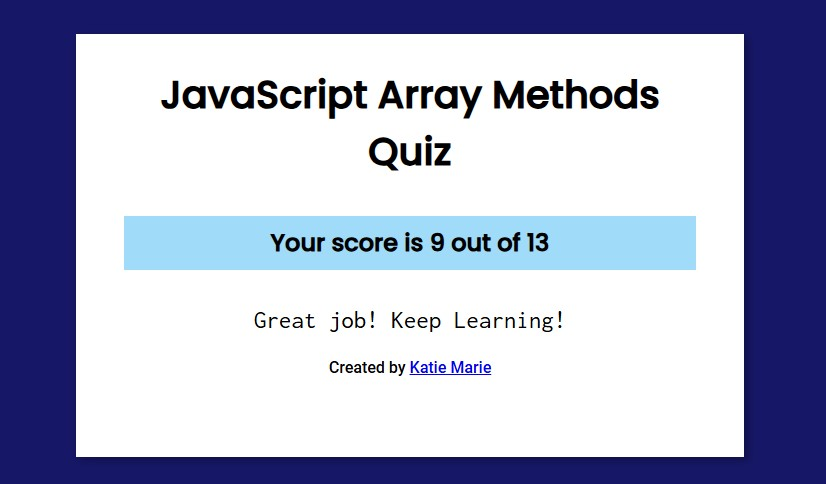

# Assignment 06
## 1.Write short notes on Array methods with code example
## push()
### The push() method adds new items to the end of an array.
### The push() method changes the length of the array.
```js
array.push(item1, item2,itemX)
```
## pop()
### The pop() method removes (pops) the last element of an array.
### The pop() method changes the original array.
```js
array.pop()
```

## shift()
### The shift() method removes the first item of an array.
### The shift() method changes the original array.
### The shift() method returns the shifted element.
``` js
array.shift()
```

## unshift()
### The unshift() method adds new elements to the beginning of an array.
### The unshift() method overwrites the original array.
``` js
array.unshift(item1, item2,itemX)
```

## includes()
### The includes() method returns true if an array contains a specified value.
### The includes() method returns false if the value is not found.
### The includes() method is case sensitive.
``` js
array.includes(element, start)
```

## toString()
### The toString() method returns a string with array values separated by commas.
### The toString() method does not change the original array.
``` js
array.toString()
```

## reverse()
### The reverse() method reverses the order of the elements in an array.
### The reverse() method overwrites the original array.
``` js
array.reverse()
```

## join()
### The join() method returns an array as a string.
### The join() method does not change the original array.
### Any separator can be specified. The default is comma (,).
``` js
array.join(separator)
```
## concat()
### The concat() method concatenates (joins) two or more arrays.
### The concat() method returns a new array, containing the joined arrays.
### The concat() method does not change the existing arrays.
``` js
array1.concat(array2, array3, ..., arrayX)
```

## flat()
### The flat() method concatenates sub-array elements.
``` js
array.flat(depth)
```

## slice()
### The slice() method returns selected elements in an array, as a new array.
### The slice() method selects from a given start, up to a (not inclusive) given end.
### The slice() method does not change the original array.
``` js 
array.slice(start, end)
```

## splice()
### The splice() method adds and/or removes array elements.
### The splice() method overwrites the original array.
``` js
array.splice(index, count, item1, ....., itemX)
```

## sort()
### The sort() method sorts the elements of an array.
### The sort() method sorts the elements as strings in alphabetical and ascending order.
### The sort() method overwrites the original array.
``` js
array.sort(compareFunction)
```

## fill()
### The fill() method fills specified elements in an array with a value.
### The fill() method overwrites the original array.
### Start and end position can be specified. If not, all elements will be filled.
``` js
array.fill(value, start, end)
```

## filter()
### The filter() method creates a new array filled with elements that pass a test provided by a function.
### The filter() method does not execute the function for empty elements.
### The filter() method does not change the original array.

``` js
array.filter(function(currentValue, index, arr), thisValue) 
```

## some()
### The some() method checks if any array elements pass a test (provided as a callback function).
### The some() method executes the callback function once for each array element.
### The some() method returns true (and stops) if the function returns true for one of the array elements.
### The some() method returns false if the function returns false for all of the array elements.
### The some() method does not execute the function for empty array elements.
### The some() method does not change the original array.

``` js 
array.some(function(value, index, arr), this)
```

## every()
### The every() method executes a function for each array element.
### The every() method returns true if the function returns true for all elements.
### The every() method returns false if the function returns false for one element.
### The every() method does not execute the function for empty elements.
### The every() method does not change the original array

``` js
array.every(function(currentValue, index, arr), thisValue)
```
## map()
### map() creates a new array from calling a function for every array element.
### map() does not execute the function for empty elements.
### map() does not change the original array.
 ``` js
 array.map(function(currentValue, index, arr), thisValue)
 ```

## forEach()
### The forEach() method calls a function for each element in an array.
### The forEach() method is not executed for empty elements.

``` js
array.forEach(function(currentValue, index, arr), thisValue)
```
## reduce()
### The reduce() method executes a reducer function for array element.
### The reduce() method returns a single value: the function's accumulated result.
### The reduce() method does not execute the function for empty array elements.
### The reduce() method does not change the original array.
```js
array.reduce(function(total, currentValue, currentIndex, arr), initialValue)
```

## indexOf()
### The indexOf() method returns the first index (position) of a specified value.
### The indexOf() method returns -1 if the value is not found.
### The indexOf() method starts at a specified index and searches from left to right (from the given start postion to the end of the array).
### By default the search starts at the first element and ends at the last.
### Negative start values counts from the last element (but still searches from left to right).
``` js
array.indexOf(item, start)
```

# 2 Quiz (https://javascript-array-methods-quiz.netlify.app/) 



